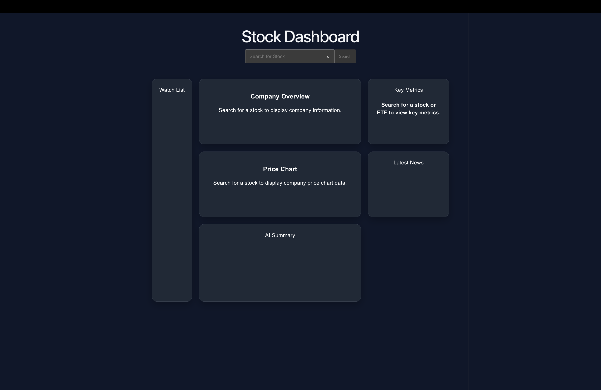
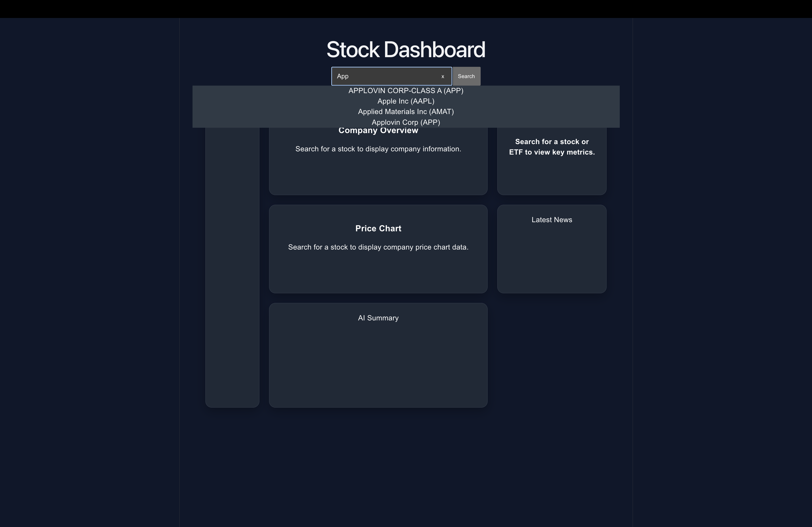
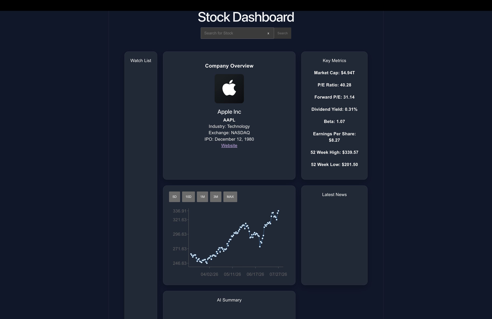

# Stock Dashboard

A full-stack stock research dashboard built with React, Python, and Flask. The application allows users to search for stocks and ETFs, view company information, key financial metrics, and historical price data.

## Tech Stack

### Frontend
- React
- Vite
- JavaScript
- CSS
- Recharts

### Backend
- Python
- Flask
- Flask-CORS

### APIs
- Finnhub API
- Alpha Vantage API

## Screenshots

### Landing Page

### Search Suggestions

### Dashboard After Selecting a Stock

## Current Features

- Stock Search
- Search Suggestions
- Company Information
- Company Logo
- Key Financial Metrics
- Interactive Historical Price Charts (5D, 10D, 1M, 3M, ALL)
- Stock & ETF Support
- Error Handling
- Loading States

## Planned Features

- Watchlist
- Latest Financial News
- AI Stock Summaries
- AI Stock Comparisons
- Portfolio Insights

## Status

🚧 Active Development
